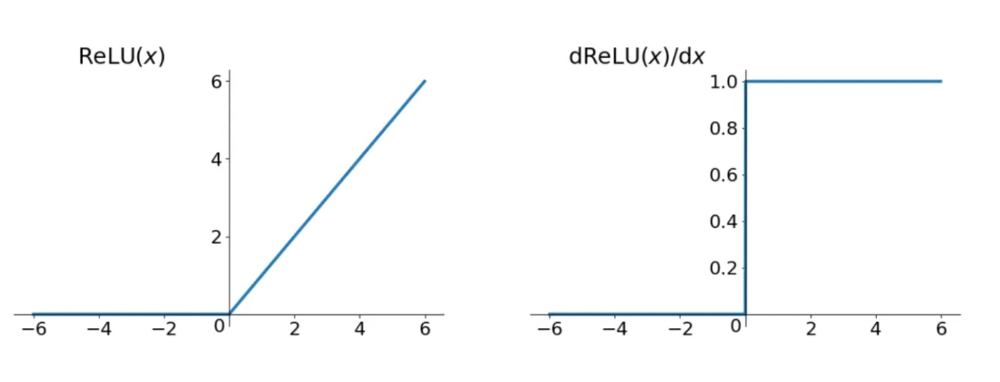
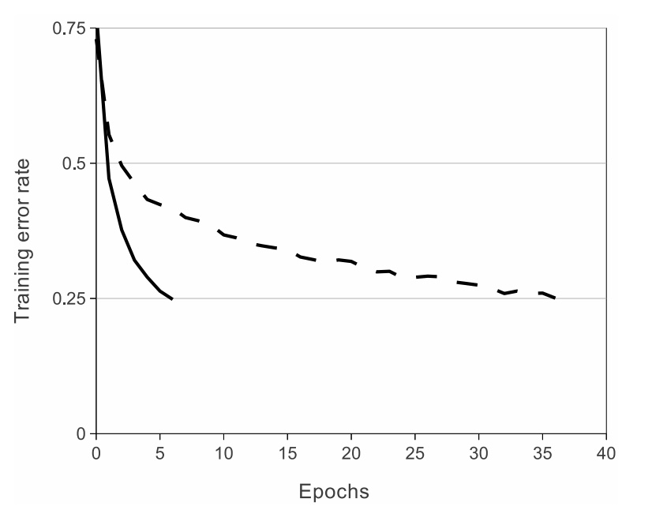
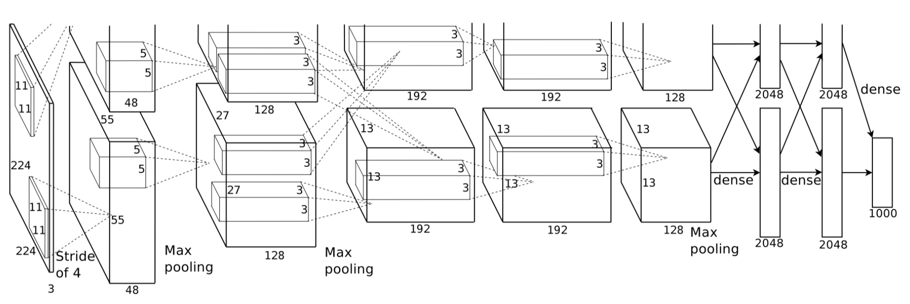
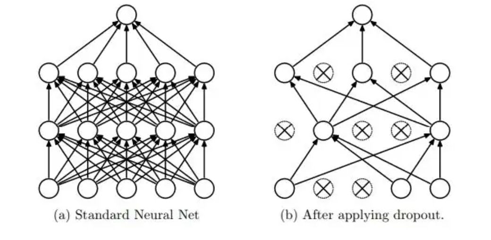
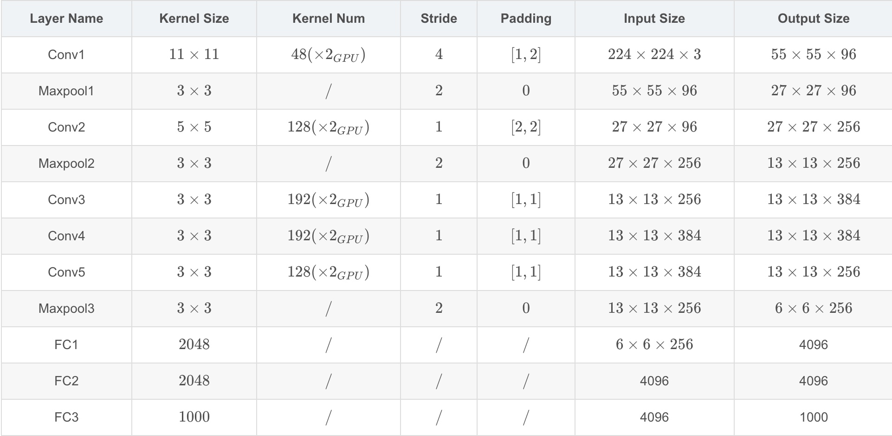

# AlexNet

**Model Innovation**

1.Relu is used as the activation function instead of the traditional sigmoid and tanh.

Relu is an unsaturated function. In this paper, it is verified that its effect exceeds sigmoid in a deeper network, and
the gradient dispersion problem of sigmoid in a deeper network is successfully solved.

2.Model training on multiple GPUs

Improve the training speed of the model and the use scale of data

3.Using random drop technique (dropout)

Selectively ignore individual neurons in training,avoid overfitting of the model.

**Model Architecture**

The architecture of AlexNet is 5(convolution layer,relu and pool)+3(full connect layer).

